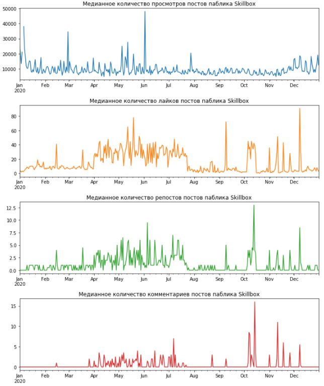
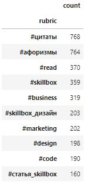
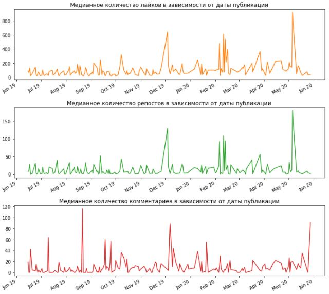
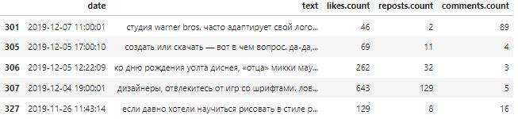
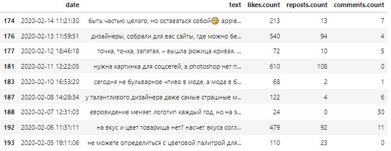
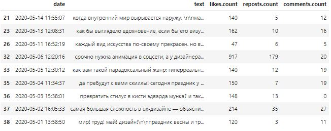

# Аналитический отчет для SMM-отдела
Выгрузить посты со стены паблика Skillbox за интересующий период. Проанализировать влияние различных факторов на вовлеченность пользователей (количество лайков, комментариев, голосов в опросах). Подготовить аналитику по рубрикам, которые есть в паблике. Составить перечень рекомендаций для SMM-отдела по итогам анализа.

## Подключение библиотек
```python
# Импорт основных библиотек
import math
import requests
import numpy as np
import pandas as pd

# Импорт библиотеки DateTime
from datetime import datetime
```

## Загрузка исходных данных
```python
# Определение основных параметров запроса
url = 'https://api.vk.com/method/wall.get'
token = '72dcb67872dcb67872dcb6785b72ae8662772dc72dcb6782c1740804e0b1207aa8a90ff'
domain = 'skillbox_education'
version = 5.107
offset = 0

# Получение количества постов на стене паблика Skillbox
response = requests.get(url, params={'access_token': token, 'v': version, 'domain': domain, 'count': 1})
count_posts = response.json()['response']['count']

# Получение всех постов стены паблика Skillbox
all_posts = list()

while offset <= math.ceil(count_posts / 100) * 100:
    response = requests.get(url, params={'access_token': token, 'v': version, 'domain': domain, 'count': 100, 'offset': offset})
    all_posts.extend(response.json()['response']['items'])
    offset += 100

# Формирование датасета с выгруженными постами 
posts_df = pd.json_normalize(all_posts)
```
## Предобработка данных
```python
# Преобразование значений в колонке 'date' в формат даты
posts_df['date'] = posts_df['date'].apply(datetime.fromtimestamp)

# Преобразование текста в колонке 'text' к нижнему регистру
posts_df['text'] = posts_df['text'].str.lower()
```

## Анализ влияния различных факторов на вовлеченность пользователей
```python
# Определение основных объектов диаграммы
fig, axes = plt.subplots(4, 1, figsize=(10, 12))

# Формирование датасета для построения графиков
chart_df = posts_df.pivot_table(
    values=['views.count', 'likes.count', 'reposts.count', 'comments.count'], 
    index=pd.to_datetime(10000 * 2020 + 100 * posts_df.date.dt.month + posts_df.date.dt.day, format='%Y%m%d'), 
    aggfunc=np.median)

# Словарь заголовков
titles = {'views': 'Медианное количество просмотров постов паблика Skillbox',
          'likes':'Медианное количество лайков постов паблика Skillbox', 
          'reposts': 'Медианное количество репостов постов паблика Skillbox', 
          'comments': 'Медианное количество комментариев постов паблика Skillbox'}

# Вывод графиков на страницу
chart_df['views.count'].plot(ax=axes[0], color='tab:blue', title = titles['views'])
chart_df['likes.count'].plot(ax=axes[1], color='tab:orange', title = titles['likes'])
chart_df['reposts.count'].plot(ax=axes[2], color='tab:green', title = titles['reposts'])
chart_df['comments.count'].plot(ax=axes[3], color='tab:red', title = titles['comments'])

# Подписание осей координат
for ax in axes.flat:
    ax.set(xlabel=None, ylabel=None)

# Автоматическое позиционирование элементов графика
fig.tight_layout()

# Отображение графика на странице
plt.show()
```


## Вывод
На графиках, отражающих вовлеченность, пользователей в различные периоды времени календарного года видно, что в периоды с апреля по июль и с октября по декабрь пользователи проявляют наибольший интерес к опубликованному материалу на стене паблика Skillbox. В весенне-летний период наблюдается не только высокий, но и стабильный интерес к постам паблика Skillbox.

## Анализ по рубрикам, которые есть в паблике
### Вывод самых публикуемых рубрик паблика Skillbox
```python
# Импорт модуля регулярных выражений
import re

# Формирование полного списка рубрик
rubric_list = posts_df['text'].str.findall('#\w+').apply(lambda x: ','.join(x)).to_list()
rubric_list = ','.join(rubric_list).split(',')

# Формирование датасета рубрик
rubric_df = pd.DataFrame({'rubric': rubric_list, 'count': 1})

# Удаление из датасета пустых позиций
rubric_df = rubric_df.query('rubric!=""')

# Вывод 10 популярных рубрик
rubric_df.groupby('rubric').count().sort_values('count', ascending=False).head(10)
```


### Анализ постов из рубрики "skillbox_дизайн"
```python
# Импорт модуля Dates пакета Matplotlib
import matplotlib.dates as mdates

# Определение основных объектов диаграммы
fig, axes = plt.subplots(3, 1, figsize=(10, 9))

# Формирование датасета для построения графика
index_list = posts_df['text'].str.contains('#skillbox_дизайн')

chart_df = posts_df[index_list].pivot_table(
    values=['likes.count', 'reposts.count', 'comments.count'],
    index=posts_df['date'].astype('datetime64[D]'), 
    aggfunc=np.median)

# Словарь заголовков
titles = {'likes':'Медианное количество лайков в зависимости от даты публикации', 
          'reposts': 'Медианное количество репостов в зависимости от даты публикации', 
          'comments': 'Медианное количество комментариев в зависимости от даты публикации'}

# Вывод графиков на страницу
chart_df['likes.count'].plot(ax=axes[0], color='tab:orange', title=titles['likes'])
chart_df['reposts.count'].plot(ax=axes[1], color='tab:green', title=titles['reposts'])
chart_df['comments.count'].plot(ax=axes[2], color='tab:red', title=titles['comments'])

# Определение формата меток осей
for ax in axes.flat:
    ax.xaxis.set_major_locator(mdates.MonthLocator())
    ax.xaxis.set_major_formatter(mdates.DateFormatter('%b %y'))

# Подписание осей координат
for ax in axes.flat:
    ax.set(xlabel=None, ylabel=None)

# Автоматическое позиционирование элементов графика
fig.tight_layout()

# Отображение графика на странице
plt.show()
```


```python
# Вывод постов вызвавшие наибольший интерес в Декабре месяце
month_df = posts_df[['date', 'text', 'likes.count', 'reposts.count', 'comments.count']]
month_df = month_df.query('date > "2019.11.25" & date < "2019.12.10"')
month_df = month_df[month_df['text'].str.contains('#skillbox_дизайн')]

# Вывод постов
month_df
```


```python
# Вывод текста поста с наибольшим количеством лайков
month_df['text'][month_df['likes.count'].idxmax()]
```
```
'дизайнеры, отвлекитесь от игр со шрифтами. ловите подборку из семи фильмов и сериалов, которые расширят ваш профессиональный кругозор.\n\n#в_закладки_skillbox #skillbox_дизайн'
```

```python
# Вывод постов вызвавшие наибольший интерес в Феврале месяце
month_df = posts_df[['date', 'text', 'likes.count', 'reposts.count', 'comments.count']]
month_df = month_df.query('date > "2020.02.05" & date < "2020.02.15"')
month_df = month_df[month_df['text'].str.contains('#skillbox_дизайн')]

# Вывод постов
month_df
```


```python
# Вывод текста поста с наибольшим количеством лайков
month_df['text'][month_df['likes.count'].idxmax()]
```
```
'нужна картинка для соцсетей, а photoshop нет под рукой? воспользуйтесь бесплатными сервисами по созданию изображений. не ищите, мы уже все собрали для вас.\n\ncanva. в вашем распоряжении миллионы фотографий, векторных изображений и иллюстраций, сотни шрифтов, множество иконок и фильтров. создавайте картинки для любых целей. соцсети, обложки для блогов и книг, открытки, инфографика, ресторанное меню — canva может почти все.\n\ncrello. здесь можно работать не только со статичными изображениями, но даже с анимацией. не нравятся имеющиеся шрифты? загрузите свои, в этом нет никаких ограничений. кстати, для вашего вдохновения собрана целая галерея готовых работ.\n\nadobe spark. в сервисе есть готовые шаблоны, по которым очень удобно работать. ничего, если у вас нет опыта в дизайне: adobe spark на каждом шагу дает подсказки.\n\ngiphy gif maker. простой и удобный сервис для создания гифок. перед началом работы необязательно скачивать видео: достаточно дать на него ссылку. к гифке можно добавить надписи, фильтры и стикеры. из недостатков: сервис работает только с видео до 15 минут.\n\nget stencill. в этом сервисе за несколько секунд можно сделать крутые картинки для соцсетей, привлекательную рекламу, броские обложки для блогов и многое другое. более 60 нестандартных размеров, свыше 1000 шаблонов, 100 000 цитат для мотивирующих изображений, около 3 000 шрифтов.\n\n#в_закладки_skillbox #skillbox_дизайн #skillbox_маркетинг'
```

```python
# Вывод постов вызвавшие наибольший интерес в Мае месяце
month_df = posts_df[['date', 'text', 'likes.count', 'reposts.count', 'comments.count']]
month_df = month_df.query('date > "2020.05.01" & date < "2020.05.15"')
month_df = month_df[month_df['text'].str.contains('#skillbox_дизайн')]

# Вывод постов
month_df
```


```python
# Вывод текста поста с наибольшим количеством лайков
month_df['text'][month_df['likes.count'].idxmax()]
```
```
'срочно нужна анимация в соцсети, а у дизайнера майские праздники?\n\nловите подборку сервисов, которые помогут «оживить» картинку, даже если вы не умеете рисовать. читайте в карточках!\n\n#в_закладки_skillbox #skillbox_дизайн'
```
## Вывод
Одна из самых публикуемых рубрик на паблике Skillbox - "#Skillbox_Дизайн" (203 публикации). Анализ вовлеченности пользователей по данной рубрике, за весь период ее публикации, показывает, что на Декабрь, Февраль и Май приходится наибольшая активность. Активность в Декабре обусловлена публикацией поста с подборкой из семи фильмов и сериалов, что получило наибольший отклик от пользователей. В Феврале активность пришлась на пост с бесплатными сервисами по созданию изображений, в Мае - пост с сервисами по "оживлению" картинок.

Из проведенного анализа по рубрике "#Skillbox_Дизайн" следует, что наибольшей популярностью среди пользователей пользуются посты с бесплатными и уникальными сервисами, а также посты с нестандартной подачей материала.

## Рекомандации для SMM-отдела
Учитывая сезонность интереса пользователей к информации, публикуемой на стене Skillbox, основную маркетинговую активность по продвижению курсов лучше планировать в весенне-летний период.

Также необходимо обратить внимание на подачу материала постов - нестандартная подача информации пользуется популярностью, например, видео материал. Среди пользователей популярны посты с хорошей практической ценностью - полезная информация, которую можно применить на практике и получить хороший результат.
